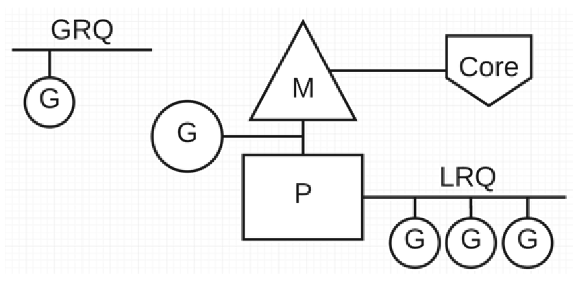
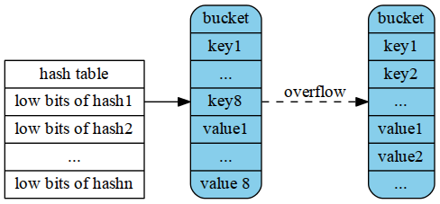

### go调度（GPM模型）

go程序通过调度器调度goroutine在内核线程上执行，但是goroutine并不直接绑定内核线程（M），而是通过goroutine scheduler的P来获取内核线程资源。

GPM包括4个结构：

* G：goroutine，G并非执行体，需要绑定到P才能被调度执行
* P:Processer，对于G而言，P相当于处理器，G只有绑定到P才能被调度执行。对于M而言，P提供了执行环境，上下文，内存分配状态，任务队列等，P决定了系统的最大并发度（物理核数>=P）,一般P的数量取可用的物理核数
* M:OS内核线程的抽象，代表着可用的计算资源，M绑定P后，进入scheduler开始调度；M不保留G的状态，这是G可以跨M调度的基础
* S：scheduler，go调度器，从P的队列获取G，并且执行G

GPM模型如下图所示：



Go调度器有两个队列，GRQ为全局队列和LRQ为本地队列，GRQ适用于尚未分配给P的goroutine；从图中可以看到G的数量可以远远的大于M，所以Go程序可以用少量的内核级线程来支撑大量goroutine的并发

调度策略：

* 工作窃取：当每个P的任务不均衡时，调度器允许从GRQ或者从其他LRQ获取G执行
* 减少阻塞，go中阻塞主要有以下场景：
  1. 由于锁，或者通道操作导致goroutine阻塞，切换队列中的另一个G执行
  2. 由于网络请求和IO操作导致goroutine阻塞，go使用网络轮询器来处理网络请求和I/O操作，使用网络轮询器可以防止goroutine在进行网络请求时阻塞M，不用创建新的M就可以继续执行P的LRQ中的其它goroutine，减少操作系统的负担。
  3. 当进行同步的系统调用时，网络轮询器将无法使用，此时调度将把M和G与P分离，引入新的M来服务P。
  4. 执行sleep被阻塞，监控线程sysmon监控长时间运行的任务，并把它设置为可以抢占。

### Go map实现

go map的底层采用Hash表实现

* 数据结构

  ```go
  type hmap struct {
  	count     int //当前Hash表中元素的数量
  	flags     uint8 
  	B         uint8 //表示当前哈希表持有的 buckets 数量，但是因为哈希表中桶的数量都 2 的倍数，所以en(buckets) == 2^B；
  	noverflow uint16
  	hash0     uint32
  
  	buckets    unsafe.Pointer
  	oldbuckets unsafe.Pointer //扩容时保存之前的buckets
  	nevacuate  uintptr
  
  	extra *mapextra
  }
  ```

  每个bucket长度为8，如果大于8则会采用溢出桶的方式，新建一个bucket并将其与原来的bucket链起来，按照key的类型采取相应的hash算法进行hash运算，根据hash值的低8位找到相应的bucket，再根据高八位找到对应的值（高八位不是offset，而是用于加速比较，遍历bucket时，先比较tophash再比较key的值）



* 增量扩容

  当负载因子（元素数量/hash表的长度）大于6.5时就会触发扩容（2^B+1）,扩容之后需要重新计算在hash表中的位置，并且搬过去，go采取的是增量扩容，每次insert时都会触发元素分流

### Go slice的实现

```go
type SliceHeader struct {
	Data uintptr
	Len  int
	Cap  int
}
```

* 扩容规则:
  1. 新容量大于原容量的两倍，直接使用新容量
  2. 小于1024直接将容量翻倍
  3. 大于1024每次扩容25%，直到满足要求

### context

context是用来设置截止时间，同步信号，传递请求相关值的结构体

```go
type Context interface {
	Deadline() (deadline time.Time, ok bool)
	Done() <-chan struct{}
	Err() error
	Value(key interface{}) interface{}
}
```


