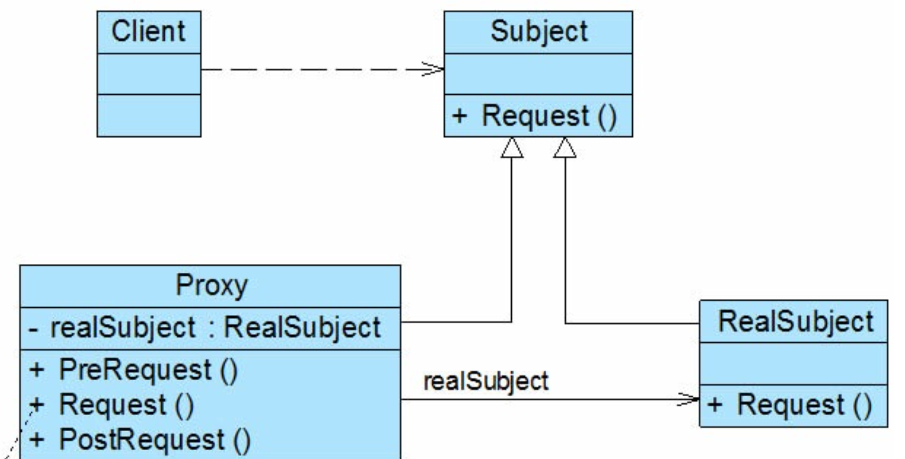
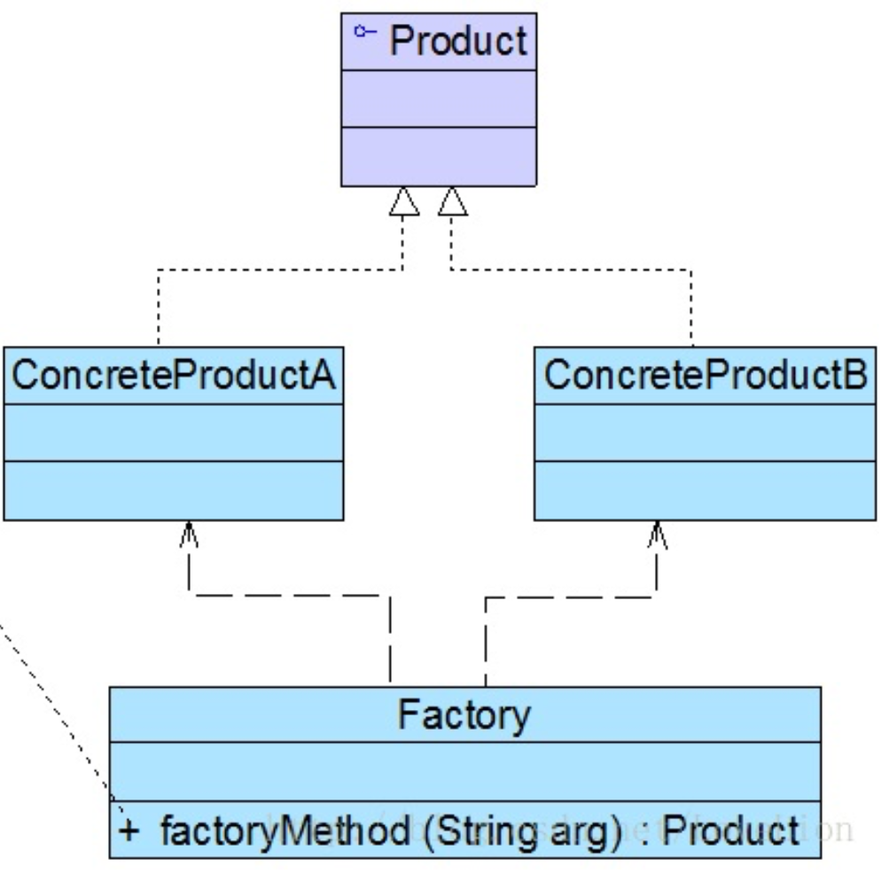
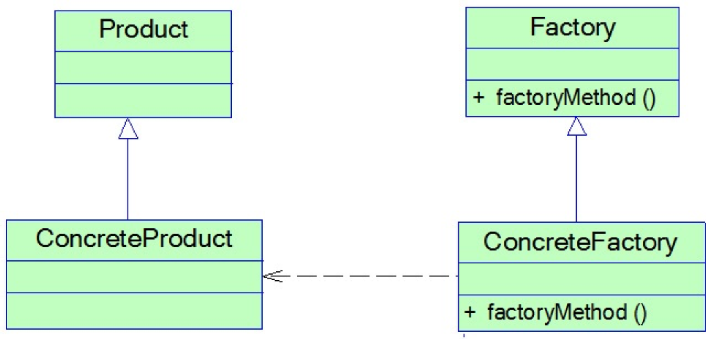
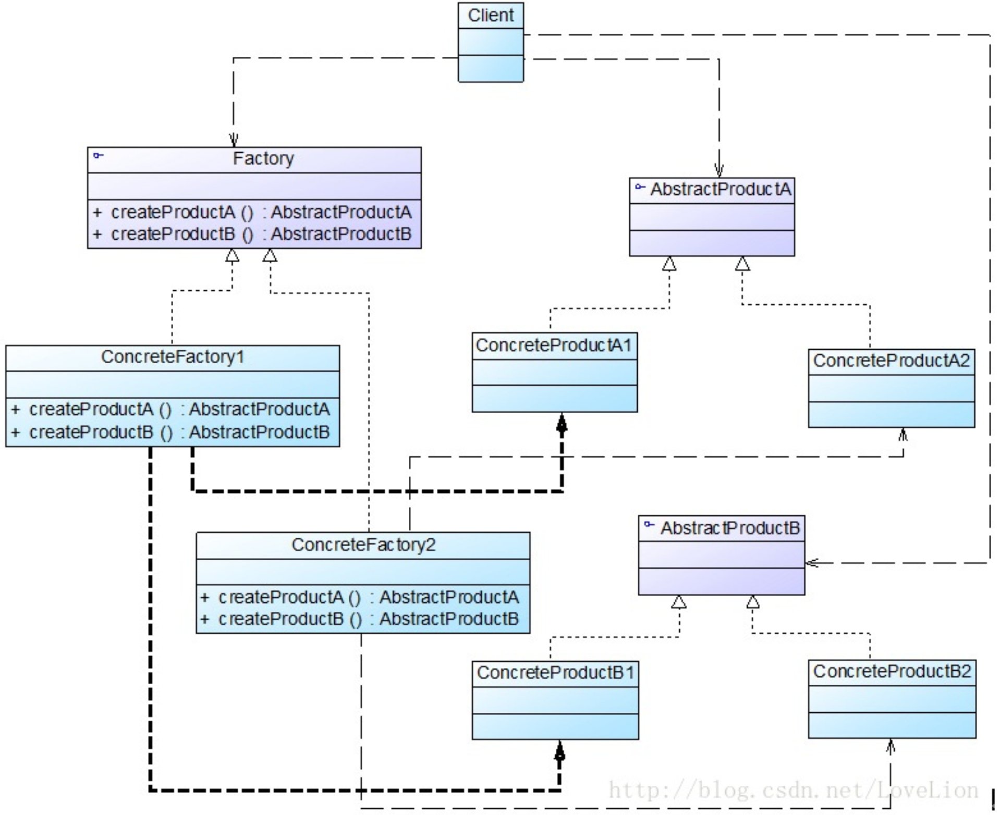
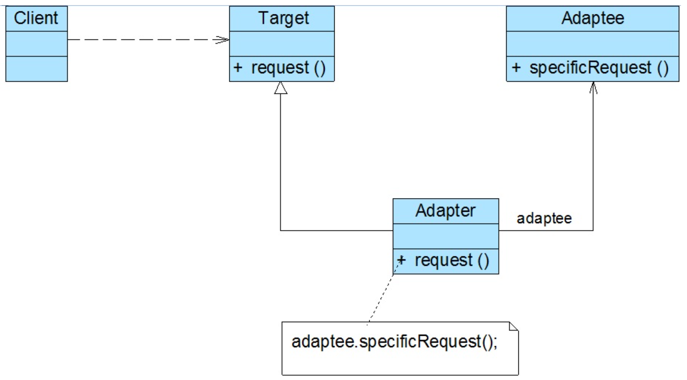
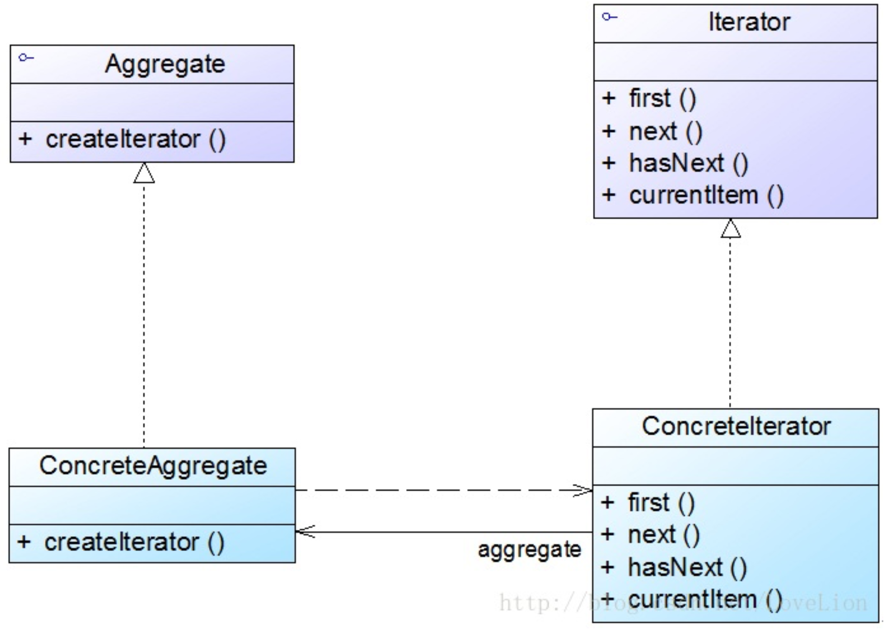
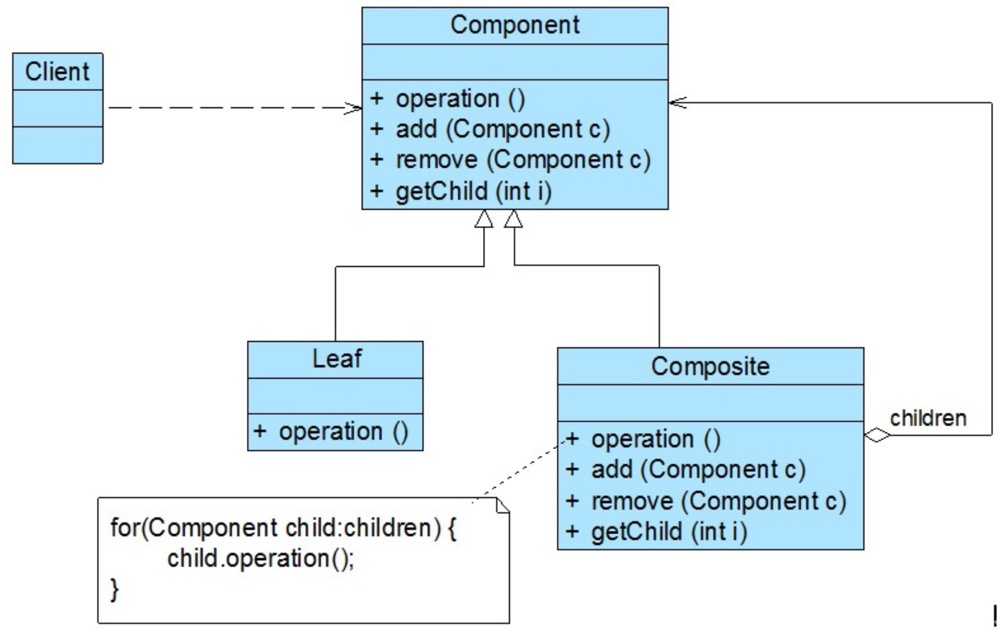
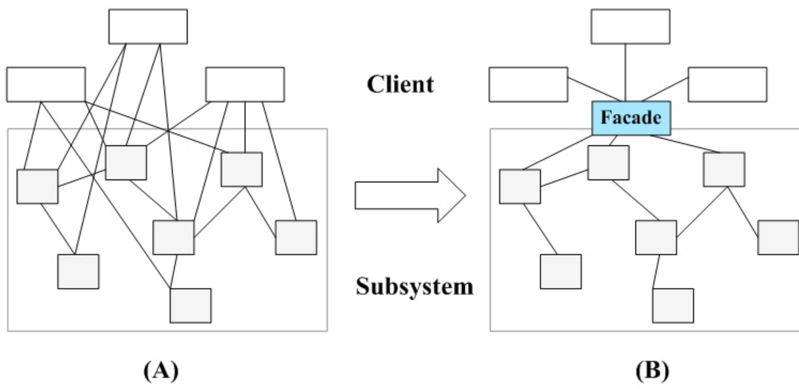
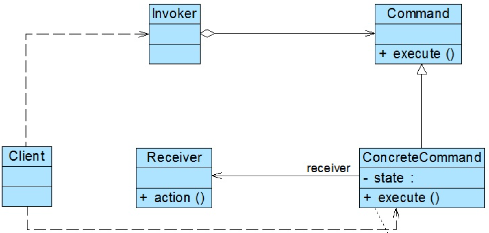
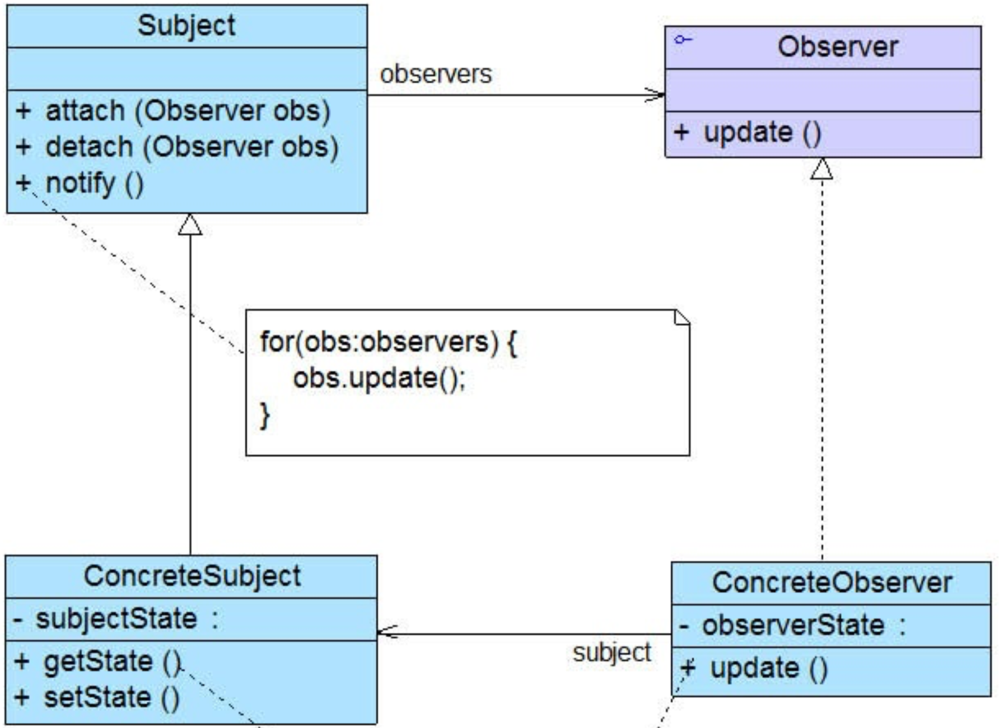

# 1. 操作系统

## 1. Linux

### 1. 文件系统

1. 组成
   * inode
   
     记录文件的属性，一个文件占用一个inode，同时记录此文件的数据所在的 block 号码；
   
   * Block
   
     实际记录文件的内容，若文件太大时，会占用多个 block
   
   * superblock
   
     记录此 filesystem 的整体信息，包括inode/block的总量、使用量、剩余量， 以及文件系统的格式与相关信息等；

2. 数据恢复的原理

   * 日志式文件系统 （Journaling filesystem）

     万一数据的纪录过程当中发生了问题，那么我们的系统只要去检查日志记录区块， 就可以知道哪个文件发生了问题，针对该问题来做一致性的检查即可，而不必针对整块 filesystem 去检查， 这样就可以达到快速修复 filesystem 的能力了

### 2. 实体链接和符号链接

1. 实体链接

   * 每个文件都会占用一个 inode ，文件内容由 inode 的记录来指向
   * 想要读取该文件，必须要经过目录记录的文件名来指向到正确的 inode 号码才能读取。
   * hard link 只是在某个目录下新增一笔文件名链接到某 inode 号码的关连记录而已。
   *  hard link 设置链接文件时，磁盘的空间与 inode 的数目都不会改变， hard link 只是在某个目录下的 block 多写入一个关连数据而已，既不会增加 inode 也不会耗用 block 数量
   * 不能跨 Filesystem；
   * 不能 link 目录

2. 符号链接

   * Symbolic link 就是在创建一个独立的文件，而这个文件会让数据的读取指向他 link 的那个文件的文件名
   *  Symbolic link 所创建的文件为一个独立的新的文件，所以会占用掉 inode 与 block

3. 使用

   ```shell
   ln [-sf] 来源文件 目标文件
   选项与参数：
   -s  ：如果不加任何参数就进行链接，那就是hard link，至于 -s 就是symbolic link
   -f  ：如果 目标文件 存在时，就主动的将目标文件直接移除后再创建！
   ```

### 3.常用命令

1. 文件查看

   ```shell
   cat 目标文件
   more 分页形式
   head 前几行
   tail 后几行
   ```

2. 搜索

   ```shell
   which 指令搜索
   find [basedir] [option] 文件搜索
   example: find . -name "shadow*"
   ```

3. 管道指令

   * 提取指令

     ```sh
     $ cut
     -d ：分隔符
     -f ：经过 -d 分隔后，使用 -f n 取出第 n 个区间
     -c ：以字符为单位取出区间
     示例：last显示登入者的信息，取出用户名
     $ last | cud -d ' ' =f 1
     ```

   * 排序指令

     ```sh
     $ sort [-fbMnrtuk] [file or stdin]
     -f ：忽略大小写
     -b ：忽略最前面的空格
     -M ：以月份的名字来排序，例如 JAN，DEC
     -n ：使用数字
     -r ：反向排序
     -u ：相当于 unique，重复的内容只出现一次
     -t ：分隔符，默认为 tab
     -k ：指定排序的区间
     示例：/etc/passwd文件内容以：来分隔，要求以第三列进行排序
     $ cat /etc/passwd | sort -t ':' -k 3
     ```

4. 正则表达式

   * grep

     g/re/p（globally search a regular expression and print)，使用正则表示式进行全局查找并打印。

     ```sh
     $ grep [-acinv] [--color=auto] 搜寻字符串 filename
     -c ： 统计个数
     -i ： 忽略大小写
     -n ： 输出行号
     -v ： 反向选择，也就是显示出没有 搜寻字符串 内容的那一行
     --color=auto ：找到的关键字加颜色显示
     ```

   * awk

     awk 每次处理一行，处理的最小单位是字段，每个字段的命名方式为：$n，n 为字段号，从 1 开始，$0 表示一整行。

     示例：取出最近五个登录用户的用户名和 IP

     ```sh
     $ last -n 5 | awk '{print $1 "\t" $3}'
     ```

### 4.僵尸进程和孤儿进程

子进程是通过父进程创建的，子进程在创建新的进程。子进程的结束和父进程的运行是一个异步过程,即父进程永远无法预测子进程 到底什么时候结束。 当一个 进程完成它的工作终止之后，它的父进程需要调用wait()或者waitpid()系统调用取得子进程的终止状态。

1. 孤儿进程

   父进程在fork出子进程之后先于子进程退出，那么子进程会被init进程收养，孤儿进程不会对系统造成任何伤害

2. 僵尸进程

   * 一个进程执行了exit系统调用退出，而其父进程并没有为它收尸(调用wait或waitpid来获得它的结束状态)的进程。

   * 任何一个子进程(init除外)在exit后并非马上就消失，而是留下一个称外僵尸进程的数据结构，等待父进程处理。这是每个子进程都必需经历的阶段。另外子进程退出的时候会向其父进程发送一个SIGCHLD信号。
   * 消灭僵尸进程只需要将其父进程杀死，僵尸进程就会被init进程收养，回收其资源

3. 避免僵尸进程

   * 父进程忽略SIGCHLD信号，此信号将交由内核处理，可以提高服务器的并发量
   * 如果父进程很忙可以用signal注册信号处理函数，在信号处理函数调用wait/waitpid等待子进程退出
   * 连续fork两个进程，使用子进程创建孙进程执行任务，立即杀死子进程并回收，孙进程将变成孤儿进程被init收养

## 2.基础

### 1. 进程的状态

1. 状态

* 创建状态（new）

* 就绪状态（ready）：等待被调度
* 运行状态（running）
* 阻塞状态（waiting）：等待资源
* 结束状态

1. 注意事项
   * 就绪和运行可以相互转换，cpu时间片用完就从运行转入就绪，获得时间片就从就绪转为运行
   * 阻塞状态是缺少除cpu时间之外的其它资源

### 2. 进程之间的通信方式

1. 管道

   半双工的通信方式，一个进程写，另一个进程读，只能用于具有血缘关系的进程间的通信；管道的实质是内核管理的一个缓冲区

2. 命名管道

   实质是一个文件，克服了管道的缺点，可以用于没有血缘关系进程间的通信

3. signal

   用于进程之间传递异步信号

4. 消息队列

   消息队列克服了信号承载信息量太少，管道只能传输无格式的字符流的缺点

5. 信号量

   计数器用于控制多个进程对共享资源的访问

6. 共享内存

   每个进程都可访问的一片内存区域，但是没有同步机制需要自己控制

7.  内存映射

   把文件映射到进程的地址空间，处理大文件可以提高效率

8.  套接字（socket）

   可以实现跨机器的进程之间的通信，套接字把服务端和客户端分开来

### 3. 线程间通信

线程间通信分为两种情况，如果是分属两个进程的线程那么通信就变成了进程间的通信

同一个进程的线程共享线程的堆，因此通信只需要把变量复制到全局的堆里就可以了

线程间的同步：互斥锁，读写锁，条件变量，信号量，自旋锁，屏障

# 2. 系统设计

### 1. 系统设计基础

#### 1.性能

1. 性能指标

   * 响应时间：某个请求从发出请求到收到响应的时间，通常采用重复请求，计算平均响应时间

   * 吞吐量：系统在单位时间内可以处理的请求数量，通常使用每秒请求数

   * 并发用户数：系统能够处理的并发用户的请求数量

     没有并发，响应时间为吞吐量的倒数

     使用多线程来处理并发请求，多线程能够提高吞吐量以及缩短响应时间，因为：

     * 多核心cpu

     * io等待时间

       并发用户数不是越多越好，如果并发用户数太多，会使得系统响应时间提高

2. 性能优化

   * 集群

     多台服务器组成集群，使用负载均衡将请求转发到集群中

   * 缓存
   * 异步：消息队列

#### 2.伸缩性

不断向集群中添加服务器来缓解不断上升的用户并发访问压力和不断增长的数据存储需求

1. 伸缩性与性能
   * 性能问题：单个用户的请求很慢
   * 伸缩性问题：单个用户请求很快，并发数很高的情况下系统会很慢

2. 实现伸缩性
   * 应用服务器：如果应用服务器无状态，通过负载均衡往集群中添加新的服务器
   * 关系数据库：通过sharding来实现，将数据按一定的规则发布到不同的节点，解决单台服务器的空间限制
   * 非关系型数据库：天生为海量数据而生，对伸缩性的支持很好

#### 3.拓展性

添加功能而不影响现有的系统，要求不同应用之间低耦合

实现可拓展性的两种方式：

1. 使用消息队列进行解耦，应用之间通过消息传递进行通信
2. 使用分布式服务将业务和可复用的服务分离开来，业务使用分布式服务框架调用可复用服务。新增的产品使用可复用的服务来实现业务逻辑，对现有的其它产品没有影响

#### 4.可用性

1. 冗余

   保证高可用的手段是冗余，当某个服务器故障就请求其它服务器

   * 应用服务器：应用服务器不具有状态，负载均衡器应将原来发往故障服务器的请求发往状态正常的服务器
   * 存储服务器：主从复制来实现，主服务器故障时，提示从服务器为主服务器

2. 监控

   对CPU，内存，磁盘，网络等系统负载信息进行监控，当某个信息达到一定阈值通知运维人员，在系统发生故障之前及时发现问题

3. 服务降级

   为了应对大量请求，系统主动关闭部分功能，保证核心功能可用

#### 5.安全性

要求系统在应对各种攻击手段时有可靠的应对措施

## 2.分布式

### 1.分布式锁

单机场景下通常使用内置锁来实现进程同步，但在分布式场景下，需要使用分布式锁

#### 1.数据库的唯一索引

利用数据库的唯一索引，获得锁插入记录，释放锁删除记录

缺点：

* 锁没有失效时间，解锁失败其它进程无法获得该锁
* 只能是非阻塞锁，插入失败就直接报错了，无法重试
* 不可重入，已经获得锁的进程也必须重新获得锁

#### 2.Redis的SETNX指令

使用SETNX设置一个键值对，如果Key已经存在，那么会返回ture，否则返回false，如果返回ture则成功获取锁

与数据库的唯一索引类似，保证只存在一个相同的key值，可以用EXPIRE设置超时时间避免释放锁失败

#### 3.ReLock算法

1. 算法内容
   * 得到本地时间
   * 使用相同的key和随机数，按照顺序在每个Master中尝试获取锁，并且设置一个快速失败时间，这样可以避免通信占用太长的时间
   * 计算获取锁消耗的时间和锁的有效时间，只有当锁的有效时间大于获取锁，并且从超过半数的master成功获取锁，才认为client成功获取了锁
   * 重新计算锁的有效时间
   * 释放锁
2. 必须部署5个节点才能具有可靠性

#### 4.Zookeeper的有序节点

zookeeper是一个为分布式应用提供一致性服务的软件，它内部是一个分层的文件系统目录结构，规定一个目录下只能有一个唯一的文件名

1. 数据模型
   * 永久节点：节点创建之后不会因为会话失效而消失
   * 临时节点：与永久节点相反，如果客户端连接失效，则立即删除节点
   * 顺序节点：与上述两个节点相似，会自动在节点之后加数字后缀，并且是有序的

2. 监视器（watcher）：为节点注册一个监听器，当节点状态发生改变时，会给客户端发送消息
3. 算法实现
   * 创建一个锁目录/lock
   * 希望获得锁的线程在目录下创建临时有序节点
   * 获取锁目录下的所有节点，判断自己是不是最小节点，如果是最小节点就获得锁
   * 如果不是最小节点则监听次小于自己的节点（避免产生羊群效应）
   * 处理完删除节点，监听该节点的线程，就会获得锁

### 2.分布式事务

#### 1.2PC

在分布式系统中，每个节点虽然可以知晓自己的操作时成功或者失败，却无法知道其他节点的操作的成功或失败。当一个事务跨越多个节点时，为了保持事务的ACID特性，需要引入一个作为**协调者**的组件来统一掌控所有节点(称作**参与者**)的操作结果并最终指示这些节点是否要把操作结果进行真正的提交

1. 运行过程

   * 准备阶段

     协调者询问参与者事务是否执行成功，参与者发回事务执行结果。询问可以看成一种投票，需要参与者都同意才能执行。

   * 提交阶段

     如果事务在每个参与者上都执行成功，事务协调者发送通知让参与者提交事务；否则，协调者发送通知让参与者回滚事务。

   在准备阶段，参与者执行了事务，但是还未提交。只有在提交阶段接收到协调者发来的通知后，才进行提交或者回滚。

### 3.负载均衡

#### 1.负载均衡算法

1. 轮询

2. 最少连接

3. 最短响应时间

   NGINX收费版本支持

4. 随机

   可以组合其它负载均衡算法

#### 2.转发实现

1. HTTP重定向

   两次请求，延迟高很少用到

2. DNS域名解析

   DNS有缓存，下线服务器要很长时间才生效，费IP地址，大多用做第一次负载均衡

3. 反向代理服务器

   主流方案，节省ip地址，缺点：代理服务器容易成为瓶颈

4. 网络层

   直接修改源IP地址，在内核态效率较高

5. 链路层

   修改MAC地址，转发回客户端不需要经过代理服务器，效率极高，LVS

   []: 

   


## 3. 消息中间件

### 1. RocketMQ和Kafka对比

1. 顺序消息

   Kafka保证一个分区内的消息是有序的，RocketMQ可以保证消息全局有序

2. 定时消息

   RocketMQ支持，Kafka不支持

3. 广播消息

   RocketMQ支持，Kafka不支持

4. 订阅形式

   Kafka基于topic以及按照topic进行正则匹配的发布订阅模式，

   发送：由topic和key决定发往那个分区，如果key为null，则轮询

   接收：每个消息只会被同一个ComsumerGroup的一个消费者消费（不支持广播），订阅同一个topic的不同ConsumerGroup都会收到此消息

   RocketMQ基于topic和tag以及消息类型及消息属性进行正则匹配的发布订阅模式

   发送：通过轮询队列的方式实现，每个队列接收平均的消息量，无法指定投递到那个队列，key最好填一个全局唯一的，因为服务器会根据key设置哈希索引

   接收：集群消费和广播消费

5. 消息重试

   kafka不支持，可以通过指定分区offset回溯的方式来实现

   RocketMQ支持，固定间隔时间之后再重试

6. 消息存储

   Kafka：高效的文件存储，支持内存，磁盘，数据库，支持大量的消息堆积

   RocketMQ：高效并且低延迟的文件存储，磁盘存储，支持大量的消息堆积，commitLog是真正存放消息的地方，ConsumeQueue队列只存放offset，size，targetcode非常小；consumeQueue相当于commitLog的索引；consumQueue的存储特性保证io都是在顺序读写一个文件，写满1G再写新的；写满4K才强制刷盘，高并发读写性能突出

7. 消息回溯

   Kafka支持指定分区offset的方式回溯，RocketMQ支持指定时间点进行回溯

8. 高可用

   Kafka通过Zookeeper来实现，Master和slave架构实现

9. 其它

   消息追踪：Kafka不支持，RocketMQ支持

   配置：Kafka使用键值对的文件配置形；RocketMQ是开箱即用的用户只需要进行少量配置

   管理界面：Kafka使用终端命令；RocketMQ有web管理后台和终端，管理后台一般需要另起一个实例


# 3.数据结构

## 1.字符串

### 1.KMP算法

1. kmp算法是一种字符串匹配算法，算法通过运用对这个词在不匹配时本身就包含足够的信息来确定下一个匹配将在哪里开始的发现，从而避免从模式串的第一个位置开始匹配

2. next数组（部分匹配表）

   next数组可以跳过最多不会匹配的子串，不放过任何一个潜在的可能匹配的子串，next数组代表下一次匹配从当前目标串的正在匹配字符和模式串的第k个位置开始匹配

   |  A   |  B   |  C   |  D   |  A   |  B   |  D   |
   | :--: | :--: | :--: | :--: | :--: | :--: | :--: |
   |  -1  |  0   |  0   |  0   |  0   |  1   |  2   |

3. next数组的值为前k-1个元素最长的公共前后缀的长度

   ABCDA前缀：A,AB,ABC,ABCD 后缀:A,DA,CDA,BCDA所以最长公共长度为

### 2.Trie树

又叫前缀树或者字典树，与二叉查找树不同，键不是保存在节点中，而是由节点的位置决定的，一个节点的所有子孙有相同的前缀，不是所有节点都有值，一般来说所有的叶子节点都对应值，部分内部节点也有值

* 节点定义

  ```java
  class TrieNode{
      private static int R = 26; //基数
      public boolean isWord;
      public TrieNode[] next = new TrieNode[R];
  }
  ```

* 数据结构定义及常用操作

  ```java
  class Trie {
      
      private TrieNode root; //树的根节点
  
      /** Initialize your data structure here. */
      public Trie() {
          root = new TrieNode();
      }
      
      /** Inserts a word into the trie. */
      public void insert(String word) {
         int len = word.length();
          TrieNode node = root;
          for(int i = 0; i < len; i++){
              int t = word.charAt(i) - 'a';
              if(null == node.next[t]){
                  node.next[t] = new TrieNode();
              }
              node = node.next[t];
          }
          node.isWord = true;
      }
      
      /** Returns if the word is in the trie. */
      public boolean search(String word) {
          int len = word.length();
          TrieNode node = root;
          for(int i = 0; i < len; i++){
              int t = word.charAt(i) - 'a';
              if(null == node.next[t]){
                  return false;
              }
              node = node.next[t];
          }
          return node.isWord;
                  
      }
      
      /** Returns if there is any word in the trie that starts with the given prefix. */
      public boolean startsWith(String prefix) {
          int len = prefix.length();
          TrieNode node = root;
          for(int i = 0; i < len; i++){
              int t = prefix.charAt(i) - 'a';
              if(null == node.next[t]){
                  return false;
              }
              node = node.next[t];
          }
          
          return node != null;
          
      }
  }
  ```

## 2.树

### 1.红黑树

红黑树是一颗自平衡的二叉查找树等同于2-3查找树，把红黑树的红节点画平就是一个3节点，红黑树有三个基本操作，分别是：左旋，右旋，变色

1. 红黑树的性质==有红必有黑，红黑不相连==

   * 节点非红即黑
* 根节点一定是黑
   * 所有叶子都是黑色（叶子是NIL节点）。
* 每个红色节点必须有两个黑色的子节点。（从每个叶子到根的所有路径上不能有两个连续的红色节点。）
   * 从任一节点到其每个叶子的所有路径都包含相同数目的黑色节点
2. 修复操作
   1. 右旋：待操作节点从左边上升为父节点，原父节点变为右孩子，原节点的右孩子变成父节点的左孩子
   2. 左旋：待操作节点从右边上升为父节点，原父节点变为左孩子，原节点的左孩子变成原父节点的右孩子
   3. 变色：对红黑树的节点进行颜色变换处理
3. 插入操作
   * 新插入的节点是红色的
   * 当前节点的父节点和叔叔节点都为红色，需要变色
   * 当前节点的父节点为红色且为不同种孩子，则以父节点为当前节点进行孩子属性的反方向旋转，进行下一步操作
   * 当前节点的父节点为红色且都为同一种孩子时， 交换祖父节点和父节点的颜色，以祖父节点为当前节点进行反方向旋转
4. 应用
   * IO多路复用epoll采用红黑树管理文件描述符，实现高效的增删改查

### 2.B树，B+树

B/B+树是专门为磁盘存储而设计的多路平衡查找树（并不是二叉的），相同节点数目下，B/B+树的高度远低于红黑树，可以大幅减少磁盘IO的次数。

1. 性质

* 所有叶子节点在同一层，B+树是B树的升级

* B+树的非叶子节点不保存记录的指针，非叶子节点可保存的索引大大增加，所有的查找都要进行到叶子节点
* B+树叶子节点存储关键字按非递减顺序存储，最后一个节点会存储下一个节点的开始

2. 为什么选择B+树
   * 由于B+树不存储数据，只存储索引，所以其内部节点比B树的更小，可以进一步减少磁盘IO的次数
   * 每次查询都会从根到叶子节点的路径，查询效率相当
   * 所有叶子节点用链表有序排列，可以实现高效范围查询

### 3.哈夫曼编码

1. 编码过程：每次从森林里选取两个权值最小的节点，构成一棵树，再把树放回森林，重复这一个过程，直到只剩一棵树
2. 带权路径长度：所有节点的权值*所在节点的高度之和

## 3.栈

### 1.栈的用途

1. 表达式求值
2. 括号匹配
3. 栈在操作系统中的应用：操作系统为每一个线程分配一块独立内存空间，用栈来组织这个内存空间，用来存储函数调用时的临时变量，每次函数调用会把其临时变量作为栈帧入栈，返回后在出栈

### 2.为什么函数调用使用栈

因为函数调用符合栈先进后出的特点，函数调用时总是先调用的函数最后执行完成，函数调用变化的就是作用域，每进入一个函数就是一个新的作用域用栈实现非常方便。进入函数时将分配一段空间给变量，函数返回时将栈顶指针恢复，就回到了原来函数的作用域。

# 4.数据库

## 锁模块

### 1. MyISAM与InnoDB关于锁方面的区别是什么

* MyISAM默认用的是表级锁，不支持行级锁 

  select的时候加读锁（共享锁），update的时候加写锁（排它锁）

* InnoDB默认用的是行级锁，也支持表级锁

  查询没有用到索引的时候用的是表锁，除了支持行锁和表锁外还支持表级意向锁，IS共享读锁，IX排它锁 

### 2. MyISAM和InnoDB适合的场景分析

1. MyISAM
   * 频繁执行全表count语句（有变量存储全表的行数）
   * 对数据进行增删改的频率不高，查询非常频繁（增删改会产生锁表操作）
   * 没有事务

2. InnoDB
   * 数据增删改查都相当频繁（只是某些行被锁，避免了阻塞）
   * 可靠性要求比较高，要求支持事务 

### 3.数据库锁分类

1. 按锁的粒度：表级锁，行级锁，页级锁
2. 按锁级别：共享锁（读锁），排它锁（写锁）
3. 按加锁方式：自动锁、显示锁（lock share mode， for update）
4. 按操作划分：DML锁、DDL锁
5. 按使用方式：乐观锁（数据版本【版本号，时间戳】），不会产生死锁 、悲观锁（排它锁是悲观锁的一种实现） 

### 4.数据库事务的四大特性

ACID

1.  原子性： 事务包含的所有操作，要么全做，要么全都不做
2. 一致性：事务确保数据库的状态从一个一致性状态从另一个一致性状态，一致性状态是指数据库的数据保持完整性约束
3. 隔离性： 多个事务并发执行时，应该互不影响
4. 持久性：保证事务对数据库的操作永久有效，InnoDB会记录所有操作日志，数据库启动时会从日志恢复 

关系

1. 满足一致性的事务的执行结果才是正确的
2. 没有并发的情况下，只要能满足原子性就可以保证一致性
3. 在并发的情况下，要同时满足原子性和隔离性才能保证事务的正确性

### 5.事务隔离级别以及各级别下的并发访问问题   

1.  事务并发访问引起的问题以及如何避免
   * 更新丢失--》mysql所有事务隔离级别在数据库层面均可避免
   
   * 脏读--》READ-COMMITTED以上事务隔离级别可以避免
   
   * 不可重复读--》REPEATABLE-READ事务隔离级别以上可避免（InnoDB默认）
   
   * 幻读--》最高事务隔离级别SERIALIZABLE可以避免 
   
     

### 6.InnoDB可重复读隔离级别下如何避免幻读

1. 当前读和快照读

   当前读：select...lock in share mode, select...for update, update, delete, insert

   快照读：不加锁的非阻塞读，select

   RC级别下当前读和快照读都读的是最新版本，RR级别下快照读取数据的版本取决于第一次创建快照的时机

2. 表像：快照读（非阻塞读）--伪mvcc
3. 内在：next-key锁（行锁+gap锁） 
   *  行锁
   * Gap锁（关键）

4. 对主键索引或者唯一索引会用Gap锁吗
   * 如果where条件全部命中（精确查询），则不会用Gap锁，只会加记录锁
   *  如果where条件部分命中或者全不命中，则会加Gap锁 

5. Gap锁会用在非唯一索引或者不走锁引的当前读中
   * 非唯一索引
   * 不走索引（需要避免） 

### 7.RC、RR级别下的InnoDB的非阻塞读如何实现（MySQL-InnoDB下的伪MVCC机制）

1. 数据行里的DB_TRX_ID（最后一个影响改行事务的id）、DB_ROLL_PTR（undo日志的最近记录）、DB_ROW_ID（行id）字段
2. undo日志
3. read view取当行的DB_TRX_ID与系统活跃的事务id中最小的做对比，沿着undo链回溯直到undo日志中的DB_TRX_ID小于系统当前活跃的事务id的最小
4. RC级别下，每次快照读都会创建一个read view，RR级别下第一次快照读创建read view
5. 最早的数据库系统只实现了读读之间的并发，读写，写读，写写都会阻塞，而采用多版本并发控制只有写写会阻塞，可以大幅提高并行度
6. 真正的MVCC在修改数据时不加排他锁，修改时复制一分再做更新，只有在提交时才会去判断是否提交成功，很有乐观锁的味道。

## 语法部分

### 1. GROUP BY

1. 满足“SELECT子句中的列名必须为分组列或列函数或者别的表的列”
2. 列函数对于group by子句定义的每个组各返回一个结果 

### 2.HAVING

1.  通常与GROUP BY子句一起使用
2. WHERE过滤行，HAVING过滤组
3. 出现在同一sql的顺序：WHERE>GROUP BY>HAVING

### 3.连接查询和子查询的比较

1. 子查询

  * 子查询中只能返回一个字段的数据
  
  * 可以将子查询的结果作为 WHRER 语句的过滤条件

2. 连接

   * 连接用于连接多个表，使用 JOIN 关键字，并且条件语句使用 ON 而不是 WHERE

   * 连接可以替换子查询，并且比子查询的效率一般会更快

   * 可以用 AS 给列名、计算字段和表名取别名，给表名取别名是为了简化 SQL 语句以及连接相同表

### 4.drop、delete、truncate

1. 作用

   * drop：删除表的结构包括数据
   * Delete:逐行从表中进行删除与where字句配合
   * Truncate:一次性的从表中删除所有数据

2. 事务

   * Delete:逐行操作会把删除操作记录在日志中以便进行回滚操作
   * drop和truncate一次操作，不会放入日志中，不支持回滚

3. 表和索引所占空间

   * Drop:会将表所占用的全部空间全部释放
   * Delete:不会改变空间的占用
   * Truncate:将表和索引所占的空间恢复到初始值

4. 耗时

   delete>truncate>drop

### 5.数据库视图

1. 视图是虚拟的表本身不包含数据，数据都存储在原始表中

2. 创建视图

   ```mysql
   create view myview as selct ...
   ```

3. 作用

   * 简化复杂查询
   * 只使用实际表的一部分数据
   * 只给用户访问视图的权限，保证数据的安全性
   * 更改数据的格式和表示

4. 何时更新

   视图不存储数据，所以更新视图需要更新原始表。如果视图只依赖一个原始表那么可以进行更新操作。如果视图定义了如下操作，就不能进行视图的更新：

   * 分组查询
   * 连接查询
   * 子查询
   * 聚集函数
   * Union
   * dinstinct
   * 计算字段

### 6.存储过程

1. 存储过程是对一系列sql操作的批处理
2. 优点
   * 代码封装，保证了一定的安全性
   * 代码复用
   * 预先编译，拥有较高的性能

3. 包含in，out和inout三种参数
4. 每次给变量赋值都需要用select into语句，每次只能给一个变量赋值

### 7.触发器

1. 触发器会在某个表执行以下语句时而自动执行：delete,insert,update
2. 触发器必须指定在语句的执行前还是之后自动执行，之前执行用defore，before用于数据的验证和净化，after用于审计和跟踪
3. insert触发器包含一个名为NEW的虚拟表，delete包含一个old虚拟表并且为只读的，update包含new和old虚拟表，new是可以被修改的，old是只读的

4. mysql不允许在触发器中使用call，也就是说不能调用存储过程

# Redis

### 1.缓存中间件-Memcache和Redis的区别

1. Memcache：代码层次类似Hash
   * 支持简单数据类型
   * 不支持数据持久化存储
   * 不支持主从
   * 不支持分片

2. Redis
   * 数据类型丰富
   * 支持数据磁盘持久化存储
   * 支持主从
   * 支持分片

### 2.为什么Redis能这么快

1. 完全基于内存，绝大部分请求是纯粹的内存操作，执行效率高
2. 数据结构简单，对数据操作也简单
3. 才用单线程，单线程也能处理高并发请求（并免锁）
4. 多路I/O复用模型，非阻塞I/O  

### 3. 说说你用过的Redis的数据类型

1. 供用户使用的数据类型
   * String：最基本的数据类型，二进制安全
   * Hash：String元素组成的字典，适合用于存储对象
   * List：列表，按照String元素插入顺序排序（最新消息通知）
   * Set：String元素组成的无序集合，通过哈希表实现，不允许重复
   * Sorted Set：通过分数来为集合中的成员进行从小到大的排序
   * 用于计数的HyperLogLog,用于支持存储地理位置信息的Geo

2. 底层数据类型基础

### 4.从海量Key里查询出某一固定前缀的Key

1. 使用keys对线上的业务的影响
   * KEYS指令一次性返回所有匹配的key
   * 键的数量过大会使服务卡顿

2. 使用SCAN
   * 基于游标的迭代器，需要基于上一次的游标延续之前的迭代过程
   * 以0作为游标开始一次新的迭代，直到命令返回游标0完成一次遍历
   * 不保证每次执行都返回某个给定数量的元素，支持模糊查询
   * 一次返回的数量不可控，只能是大概率符合count参数

### 5.如何通过Redis实现分布式锁

1. 分布式锁需要解决的问题

   * 互斥性

   * 安全性

   * 死锁

   * 容错

2. SETNX key value
3. 如何解决SETNX长期有效的问题 
   * EXPIRE key value
   * 缺乏原子性

4. SET key value ex nx

### 6.大量的key同时过期的注意事项

1. 集中过期，由于清除大量key很耗时，会出现短暂的卡顿现象
   * 解决方案：在设置key的过期时间的时候，给每个key加上随机值

### 7.如何使用Redis做异步队列

1. 使用List, rpush生产，lpop消费
   * 缺点：没有等待队列里有值就直接消费
   * 弥补：可以通过在应用层引入Sleep机制去调用LPOP重试

2. BlPOP阻塞直到队列有消息或者超时
   * 缺点：只能提供一个消费者消费
3. pub/sub:主题订阅模式
   * pub发送消息，sub接收消息
   * 订阅者可以订阅任意数量的频道 
   * 缺点：消息发布是无状态的，无法保证可达

### 8.Redis如何做持久化

1. RDB(快照)持久化：保存某个时间点的全量数据快照
   * SAVE：阻塞主进程
   * BGSAVE：Fork出一个子进程来创建RDB文件

2. 自动触发RDB持久化的方式

   * 根据redis.conf配置里的SAVE m n定时触发
   * 主从复制时
   * Debug reload
   * shutdown

3. RDB持久化

   缺点

   * 内存数据的全量同步，数据量大会由于I/O而严重影响性能
   * 可能会因为Redis挂掉而丢失从当前至最近一次快照期间的数据

4. AOF持久化：保存写状态

   * 记录下除了查询以外的所有变更数据库状态的指令
   * 以append的形式追加保存到AOF文件中(增量)

5. 日志重写解决AOF文件大小不断增大的问题，原理如下：
   * 调用fork(),创建一个子进程
   * 子进程把新的AOF写到一个临时文件里，不依赖原来的AOF文件
   * 主进程持续将新的变动同时写到内存和原来的AOF里
   * 主进程获取子进程重写AOF的完成信号，往新的AOF同步增量变动
   * 使用新的AOF文件替换掉旧的AOF文件
6. RDB和AOF混合持久化

### 9. 使用Pipeline的好处

### 10.Redis的同步机制

1. 主从同步原理
2.  

### 11.Redis Sentinel


# Java知识

### 1.谈谈你对Java的理解

平台无关性，面向对象，GC，类库，语言特性，异常处理

### 2.一次编译，到处运行如何实现

1. 编译时（javac）

   字节码，存储在.class文件中

   javap -c 反汇编 

2. 运行时

### 3.JVM如何加载.class文件

1. Java虚拟机
   * Class Loader：依据特定格式，加载class文件到内存
   * Execution Engine：对命令进行解析
   * Native Interface：融合不同开发语言的原生库为Java所用
   * Runtime Data Area：JVM内存空间结构模型

2. 谈谈反射
   * 在运行时获取类声明的属性和方法，运行对象的方法，访问对象的变量
   * class.forName()加载类，getDeclareMethod,getFiled

### 4.类从编译到执行的过程

1. 编译器将Robot.java源文件编译为Rotbot.class字节码文件
2. ClassLoader将字节码转化为JVM中Class<Robot>对象
3. JVM利用Class<Robot>对象实例化Robot对象   

### 5.谈谈ClassLoader

作用，本质，种类

### 6.ClassLoader的双亲委派机制

### 7.类的加载方式

1. 隐式加载：new
2. 显示加载：loadClass，forName等，newInstance不支持调用带参数的构造器，需要反射才能支持参数

### 8.loadClass和forName的区别

1. 类装载的过程
   * 加载loadclass
   * 链接
   * 除始化

2. Class.loadClass得到的class还未链接，Class.forName得到的class是已经初始化了的

### 9. 元素的比较

### 10.fail fast机制

1. 什么是fail fast

   fail fast是一种设计理念，在设计系统时优先考虑异常情况，一旦发生异常直接停止并上报

2. java集合类中的fail fast

   Java集合的一种错误检测机制。当多个线程对集合（非fail-safe的集合类）进行结构上的改变的操作时，有可能会产生fail-fast机制，这个时候就会抛出ConcurrentModificationException（当方法检测到对象的并发修改，但不允许这种修改时就抛出该异常）。==单线程环境中不符合规则，也会出现此异常==

3. 原理

   checkForComodification方法对modCount和expectedModCount进行了比较，如果二者不想等，则抛出CMException。

   modeCount是ArrayList中的一个成员变量，表示该集合实际被修改的次数。

   expectedModCount 是 ArrayList中的一个内部类——Itr中的成员变量。expectedModCount表示这个迭代器预期该集合被修改的次数。其值随着Itr被创建而初始化。只有通过迭代器对集合进行操作，该值才会改变。

   代码中使用了增强for循环，而在增强for循环中，集合遍历是通过iterator进行的，但是元素的add/remove却是直接使用的集合类自己的方法。这就导致iterator在遍历的时候，会发现有一个元素在自己不知不觉的情况下就被删除/添加了，就会抛出一个异常，用来提示用户，可能发生了并发修改！

4. 正确操作
   * 使用Iterator进行遍历和删除，如果是多线程环境下要对操作进行加锁
   * 使用java8中提供的filter
   * 直接使用fail-safe的集合类

5. fail-safe

   fail-safe集合的所有对集合的修改都是先拷贝一份副本，然后在副本集合上进行的，并不是直接对原集合进行修改。并且这些修改方法，如add/remove都是通过加锁来控制并发的。==只能保证最终一致性==

6. Copy-On-Write(COW)

   并发的一种新思路，实现读写分离。其基本思路是，从一开始大家都在共享同一个内容，当某个人想要修改这个内容的时候，才会真正把内容Copy出去形成一个新的内容然后再改，这是一种延时懒惰策略。CopyOnWriteArrayList中add/remove等写方法是需要加锁的，目的是为了避免Copy出N个副本出来，导致并发写。但是，CopyOnWriteArrayList中的读方法是没有加锁的。==可以实现高并发的读和遍历操作==

   ==尽量使用批量添加或者删除，避免内存大量占用从而导致频繁GC==

### 11.Java虚拟机内存划分（运行时数据区域）

1. 程序计数器

   一个较小的内存区域，线程私有，记录正在执行的虚拟机字节码指令的地址，如果是native方法则为空

2. Java虚拟机栈

   每个方法在执行时都会创建一个栈帧存储：局部变量表（存放各种基本类型，以及引用类型），操作数栈

   `栈容量由-Xss参数设定,线程请求的栈深度大于虚拟机所允许的最大深度，将抛出StackOverflowError异常，虚拟机在扩展栈时无法申请到足够的空间就会抛出OutOfMemoryError异常`

3. 本地方法栈

   与java虚拟机栈类似，主要为本地方法服务

4.堆

存放对象实例，现代垃圾收集器主要使用分代收集算法，将堆分为两块：新生代和老年代，如果堆中没有内存完成实例分配，并且堆也无法扩展，就会抛出OutOfMemoryError异常

`堆的大小由参数-Xms 最小值-Xmx最大值`

5. 方法区

   各个线程共享的内存区域，它用于存储已被虚拟机加载的类信息，常量，静态变量，即时编译器编译后的代码等数据。可以动态扩展，扩展失败会抛出OutOfMemorError异常，方法区是一个 JVM 规范，永久代与元空间都是其一种实现方式。

   从 JDK 1.8 开始，移除永久代，并把方法区移至元空间，它位于本地内存中，而不是虚拟机内存中。原来永久代的数据被分配到了堆和元空间中，元空间存储类的信息，静态变量和常量池放入堆中

6. 运行时常量池

运行时常量池是方法区的一部分，Class文件中（编译期生成的各种字面量和符号引用)的常量池会在类加载之后进入方法区的运行时常量池。运行时常量池相对于Class文件中的常量池具备动态性，运行期间也可以将新的常量放入池中。

7. 直接内存

   NIO可以使用Native函数库直接分配堆外内存，通过DirectByteBuffer对象操作这块直接内存，可以避免在堆外内存和堆内内存之间来回拷贝数据，可以显著提高性能。

## Jvm垃圾回收

### 1.判断对象是否为垃圾的算法

1. 引用计数算法
   * 优点：效率高，程序执行受影响较小
   * 无法检测出循环引用（父对象持有一个子对象的引用，子对象反过来持有父对象的引用）的情况，导致内存泄露
2. 可达性分析算法 
   * 通过判断对象的引用链是否可达来决定对象是否可以被回收，把对象的引用看成一张图
   * 可以作为GC Root的对象
     * 虚拟机栈中引用的对象（栈帧中的本地变量表）
     * 方法区中常量引用的对象
     * 方法区中的类静态属性引用的对象
     * 本地方法栈中JNI的引用对象
     * 活跃线程的引用对象
3. 谈谈你了解的垃圾回收算法
   * 标记-清除算法
     * 碎片化 
   * 复制算法
     * 解决碎片化
     * 顺序分配内存，简单高效
     * 适用于对象存活率低的场景
   * 标记-整理算法
     * 适合
   * 分代收集算法
     * stop the world
     * safepoint

### 2.GC相关的面试题

1. Object的finalize()方法的作用是否与C++的析构函数作用相同
2. Java中的强引用，软引用，弱引用，虚引用用什么用

### 3.垃圾收集器

#### 1.G1收集器

* 特点

  更少的内存碎片，可控的停顿时间，并发的垃圾收集

* 内存模型

  

  每个Reign被设计为逻辑上连续的虚拟内存，每个区域被标记为E,S,O,H;H用来存放大对象，如果一个H存不下大对象，则会寻找连续的H来存，如果找不到就进行Full GC

* 回收过程

  初始标记：会产生STW，标记从GCroot直接可达的对象，耗时很短

  并发标记：进行可达性分析，找出存活对象，耗时较长，并发进行

  最终标记：标记那些在并发阶段发生变化的对象

  筛选回收：对各个Region的回收价值和成本进行排序，根据用户制定的GC停顿时间，来制定回收计划，回收一部分region

* GC模式

  YoungGC：当Eden区达到阈值并且无法申请新的内存会触发YoungGC，会回收所有的Eden区和survivor区，把存活对象复制到old和另一部分survivor区

  MixedGC：当越来越多的对象晋升到old区，会进行mixedGC回收全部young region和部分old region从而达到可控的停顿时间。


##  java线程知识 

### 1.  进程和线程的区别

1. 进程和线程的由来

   进程是一个独立的运行环境，线程只是进程中的一个任务

2. 进程是资源分配的最小单位，线程是CPU调度的最小单位
   * 所有与进程相关的资源，都被记录在PCB中 
   * 进程是抢占处理机的调度单位；线程属于某个进程，共享其资源
   * 线程只由堆栈寄存器、程序计数器和TCB组成

3. 总结
   * 线程不能看做独立应用，而进程可看做独立应用
   * 进程有独立的地址空间，相互不影响，数据共享复杂，但是同步简单；线程共享进程的内存地址空间和其它资源，数据共享简单，同步复杂；
   * 线程没有独立的地址空间，多进程的程序比多线程程序要健壮
   * 进程的切换比线程的切换开销大，进程切换不仅要切换栈和寄存器，还要进行资源的分配和回收，内存页的调度，开销很大；而线程切换只需要切换堆栈和寄存器
   * 多进程比多线程更加稳定，多进程之间不会影响

4. 本质区别

   进程单独的占有内存地址空间和其它系统资源（IO）

   

   

### 2.Java进程和线程的关系

### 3.Thread中start和run方法的区别

*  调用start()方法会创建一个新的子线程并启动（调用JVM_StartThread）
* run()方法只是Thread的一个普通方法调用 

### 4.Thread和Runnable是什么关系

* Thread是实现了Runnable接口的类，使得run支持多线程
* 因类的单一继承原则，推荐多使用Runnable接口

### 5.如何给run()方法传参

### 6.如何实现处理线程的返回值

1. 实现方式主要有三种
   * 主线程等待法
   * 使用Thread类的join()阻塞当前线程以等待子线程处理完毕
   * 通过Callable接口实现:通过FutureTask Or 线程池获取

### 7.线程的状态

* 新建（New）：创建后尚未启动的线程的状态
* 运行（Runnable):包含Running和Ready
* 无限期等待（Waiting）：不会被分配CPU执行时间，需要显示被唤醒
* 限期等待（Timed Waiting）：在一定时间后会由系统自动唤醒
* 阻塞（Blocked）：等待获取排它锁
* 结束（Terminated):已终止线程的状态，线程已经结束执行 

### 8.sleep和wait的区别

1. 基本的差别
   * sleep是Thread类的方法，wait是Object类中定义的方法
   * sleep方法可以在任何地方使用
   * wait方法只能在synchronized方法或synchronized块使用

2. 最本质的差别
   * sleep只会让出CPU，不会导致锁行为发生改变
   * wait不仅让出CPU，还会释放已经占有的同步资源锁

### 9. yield

建议线程调度器调度线程

### 10.如何中断线程

1. 已经被抛弃的方法
   * 通过调用stop方法停止线程
   * 通过调用suspend和resume方法

2. 目前使用的方法
   * 调用interrupt，通知线程应该中断了
     * 如果被通知线程处于被阻塞状态，那么直接抛出InterruptException异常，直接退出
     * 如果处于正常活动状态，把线程的中断标志置为true，继续执行

### 11. synchronized

1. 分类：对象锁和类锁
2. 获取对象锁的两种方法
   * 同步代码块（synchronized(this), synchronized(类实例对象)），锁是小括号（）中的实例对象
   * 同步非静态方法，锁是当前类的实例对象
3. 获取类锁的两种用法
   * 同步代码块（synchronized(类.class)）,锁是小括号（）中的类对象（class对象）
   * 同步静态方法，锁是当前对象的类对象（class对象）

### 12.synchronized底层实现原理

1. 实现synchronized的基础
   * java对象头
   * Monitor：每个Java对象天生自带了一把看不见的锁

2. 可重入
3. 为什么会对synchronized嗤之以鼻
   * 早期版本中，synchronized属于重量级锁，依赖于Mutex Lock实现（操作系统提供）
   * 线程之间的切换需要从用户态切换到核心态，开销较大
4. 自旋锁与自适应自旋锁
   * 许多情况下，共享数据的锁定状态持续时间较短，切换线程不值得
   * 通过让线程执行忙循环等待锁的释放，不让出CPU
   * 缺点：若锁被其它线程长时间占用，会带来许多性能上的开销

5. 自适应自旋锁

   jvm根据获取锁的情况调整，自旋时间

6. 锁消除

   JIT编译时，对运行上下文进行扫描，去除不可能存在竞争的锁

7. 锁粗化

8. synchronized的四种状态

   * 无锁，偏向锁，轻量级锁，重量级锁

9.   偏向锁

   * 加锁和解锁不需要CAS操作，没有额外的性能消耗
   * 只有一个线程访问同步块

10. 轻量级锁
    * 竞争的线程不会阻塞，提高了响应速度
    * 若线程抢不到锁，则会自旋
    * 线程交替执行同步方法

### 13.synchronized和ReentranLock的区别

1.  总结
   * synchronized是关键字，ReetranLock是类
   * ReentrantLock可以对获取锁的等待时间进行设置，避免死锁
   * ReentranLock可以获取各种锁的信息
   * ReentranLock可以灵活地实现多路通知
   * 机制：sync操作Mark Word，lock调用Unsafe类的park方法

### 14.什么是java内存模型中的happens-before

1. 程序次序规则：一个线程内，按照代码顺序，书写在前面的操作先行发生于书写在后面的操作；
2. 锁定规则：一个unLock操作先行发生于后面对同一个锁额lock操作；
3. volatile变量规则：对一个变量的写操作先行发生于后面对这个变量的读操作；
4. 传递规则：如果操作A先行发生于操作B，而操作B又先行发生于操作C，则可以得出操作A先行发生于操作C；
5. 线程启动规则：Thread对象的start()方法先行发生于此线程的每个一个动作；
6. 线程中断规则：对线程interrupt()方法的调用先行发生于被中断线程的代码检测到中断事件的发生；
7. 线程终结规则：线程中所有的操作都先行发生于线程的终止检测，我们可以通过Thread.join()方法结束、Thread.isAlive()的返回值手段检测到线程已经终止执行；
8. 对象终结规则：一个对象的初始化完成先行发生于他的finalize()方法的开始；

### 15.CAS

### 16.volatile关键字

Java虚拟机提供的一种轻量级的同步机制

1.保证可见性

2.不保证原子性

3.禁止指令重排

* 为什么要进指令重排

  因为CPU使用了流水线技术，一条指令分为多个单元，第一条指令还未执行完就可以执行第二条指令，前提是两条指令功能单元相同或相似，所以可以通过使相同类型的指令连接执行来减少流水线中断，这样可以大大提高效率

  指令重排保证串行条件下语义一致，但是没有义务保证多线程环境下也一致；所以多线程环境下可能会出问题。

### 18.Java线程池

1. coresize：核心线程数，maxsize：最大线程数，queue：缓存队列
2. 提交的任务首先看核心线程是否空闲，核心线程空闲就直接运行，否则进入队列，如果队列满则新启动线程运行

### 19.Java对象的创建过程

1. 类加载的检查，去常量池中寻找是否有这个类对应的符号引用，并且这个类是否被加载过，初始化过，如果没有就必须执行类加载
2. 内存分配
3. 初始化零值
4. 执行init函数

## Spring框架

### 1.你了解Spring IOC么 

### 2.Spring Bean的作用域

### 3.你了解Spring AOP么

### 4.Spring事务的相关知识点

## 设计模式

### 1.代理模式



1. 静态代理

   静态代理在使用时, 需要定义接口或者父类, 被代理对象与代理对象一起实现相同的接口或者是继承相同父类.
   关键：在编译期确定代理对象，在程序运行前代理类的. class 文件就已经存在了。

2. 动态代理
   * 在运行期，通过反射机制创建一个实现了一组给定接口的新类
   * 在运行时生成的 class，必须提供一组 interface 给它，然后该 class 就宣称它实现了这些 interface。该 class 的实 例可以当作这些 interface 中的任何一个来用。但是这个 Dynamic Proxy 其实就是一个 Proxy， 它不会替你作实质性的工作，在生成它的实例时你必须提供一个 handler，由它接管实际的工 作。
   * 接口中声明的所有方法都被转移到调用处理器一个集中的方法中处理（InvocationHandler.invoke）。这样，在接口方法数量比较多的时候，我们可以进行灵活处理，而不需要像静态代理那样每一个方法进行中转。而且动态代理的应用使我们的类职责更加单一，复用性更强

### 2.单例模式（创建型模式）

1. 懒汉式-线程不安全

   私有构造方法，延迟实例化私有静态变量，所以叫懒汉式，在没有用到该资源的条件下，可以节省资源

   ```java
   public class Singleton {
   
       private static Singleton uniqueInstance;
   
     	//私有构造方法
       private Singleton() {
       }
   
       public static Singleton getUniqueInstance() {
           if (uniqueInstance == null) {
               uniqueInstance = new Singleton();
           }
           return uniqueInstance;
       }
   }
   ```

2. 饿汉式-线程安全

   直接实例化，避免多次实例化，也就不能节省资源

   ```java
   private static Singleton uniqueInstance = new Singleton();
   ```

3. 懒汉式-线程安全

   直接对getUniqueInstance方法加锁，避免多次实例化，但是即使已经被实例化也会导致只允许单线程访问，存在性能问题，不推荐使用

   ```java
   public static synchronized Singleton getUniqueInstance() {
       if (uniqueInstance == null) {
           uniqueInstance = new Singleton();
       }
       return uniqueInstance;
   }
   ```

4. 双重校验锁

   uniqueInstance只被实例化一次，就可以使用，那么只需要对实例化部分加锁，当没有实例化才进行加锁操作

   ```java
   public class Singleton {
   
     	//避免jvm对指令进行重排序，确保多线程环境下的可用性
       private volatile static Singleton uniqueInstance;
   
       private Singleton() {
       }
   
       public static Singleton getUniqueInstance() {
           if (uniqueInstance == null) {
             	//对实例化进行加锁
               synchronized (Singleton.class) {
                   if (uniqueInstance == null) {
                       uniqueInstance = new Singleton();
                   }
               }
           }
           return uniqueInstance;
       }
   }
   
   ```

5. 静态内部类

   当Singleton类被加载时，静态内部类不会被加载，只有当使用时才会加载静态内部类，这样既可以做到延时加载，也可以利用jvm提供的线程安全机制

   ```java
   public class Singleton {
   
       private Singleton() {
       }
   
       private static class SingletonHolder {
           private static final Singleton INSTANCE = new Singleton();
       }
   
       public static Singleton getUniqueInstance() {
           return SingletonHolder.INSTANCE;
       }
   }
   ```

### 3.工厂模式(创建型模式)

工厂模式是一种创建型的设计模式，负责对象的创建，工厂模式分为三种：简单工厂，工厂方法，抽象工厂。通常所说的工厂模式就是工厂方法模。为什么需要使用工厂方法：解耦（把对象的创建和使用分开），降低代码重复（创建对象可能需要很多的代码），易维护

1. 简单工厂模式

   

   它不属于GoF的23种设计模式，是工厂方法的特例

   * 组成

     工厂类（含有静态工厂方法，所以又叫静态工厂），抽象产品，具体产品

   * 缺点：由于只有一个工厂，不符合开闭原则，增加产品需要修改工厂的代码

2. 工厂方法模式

   增加了抽象工厂，每一个具体工厂，负责生产具体产品

   

   ```java
   //抽象工厂
   interface ShapeFactory{
      Shape getShape();
   }
   
   //抽象产品
   interface Shape{
   }
   
   //具体产品
   class Circle implements Shape{
     
   }
   
   //具体工厂
   class CircleFactory implements ShapeFactory{
     @Override
     Public Shape getShape(){
       return new Circle();
     }
     
   }
   ```

3. 抽象工厂方法

   一个工厂负责生产多个互相依赖的产品，工厂方法模式一个工厂只负责生产一种产品,大大减少了工厂类的数量，对添加新的产品族是开放的，但对于添加新的产品结构是封闭的，因此需要提前设计好产品的结构。

   

### 4.MVC设计模式（结合SpringMVC）

MVC设计模式也就是模型（Model），视图（View），控制器（Controller）

### 5.装饰器模式(扩展系统功能-结构型模式)

装饰器模式动态的为对象添加职责，比子类更加灵活。使用对象之间的关联关系取代了继承关系，装饰器设计模式的核心在于其抽象装饰

具体角色：

* Component（抽象构件）：具体构件和抽象装饰的父类，它的引入，可以使客户端在使用装饰后的构件和未经装饰的构件一视同仁
* ConcreteComponent(具体构件)：实现抽象构件，可以被装饰
*  Decorator(抽象装饰类):抽象构件类的子类，持有一个抽象构件的引用，通过该引用调用构件的方法，子类扩展该方法，起到装饰的目的

```java
abstract class Decorator implements Component {
    private Component component; //维持一个对抽象构件对象的引用

    //注入一个抽象构件类型的对象
    public Decorator(Component component) {
         this.component=component;
    }

    public void operation() {
        component.operation(); //调用原有业务方法
    }
}
```

*  ConcreteDecorator(具体装饰类):抽象装饰类的子类，可以为构件类添加职责。

### 6.适配器模式（不兼容结构的协调-结构型模式）

使一个接口转化为另一个接口（广义的接口），使得不兼容的类可以一起工作



具体角色：

* Target（目标抽象类）：客户端希望使用的类

* Adapter（适配器类）：作为一个转换器，持有被适配对象引用，实现目标抽象类，适配器类是适配器模式的核心

  ```java
  class Adapter extends Target {
      private Adaptee adaptee; //维持一个对适配者对象的引用
  
      public Adapter(Adaptee adaptee) {
          this.adaptee = adaptee;
      }
  
      public void request() {
          adaptee.specificRequest(); //转发调用
      }
  }
  ```

  

* Adaptee（适配者类）：被适配对象，存在客户端希望使用的方法

对象适配器：如上所示

类适配器：通过继承适配者类来适配

### 7.迭代器模式（遍历聚合对象中的元素-行为型模式）



提供一种方法来访问聚合对象，而不暴露这个聚合对象的内部结构，为了让迭代器访问聚合对象的数据，我们可以将迭代器类设计为聚合类的内部类，jdk中的迭代器类就是这样实现的

###8.面向对象的设计原则

1. 单一职责原则：一个类只负责一个功能领域中的相应职责
2. 开闭原则：一个软件实体应对拓展放，对修改封闭，即在添加新功能的时候无需改动原有代码
3. 里氏代换原则：使用基类的地方换成子类，应该不受影响，反过来则不一定，是实现开闭原则的重要方式
4. 依赖倒置原则：面向高层抽象编程，开闭原则是目标，里氏代换原则是基础，依赖倒置原则是手段
5. 合成复用原则：尽量使用组合和聚合来实现复用，避免使用继承

### 9.组合模式（树形结构的处理-结构型模式）

组合多个对象形成树形结构以表示具有整体-部分的关系的层次结构



具体角色：

* 抽象构件（Component）：在抽象构件中定义了访问和管理叶子构件的方法
* 叶子构件（Leaf）：叶子节点没有子节点
* 容器构件（Composite）：容器节点包含容器节点或者叶子节点

### 10.外观模式(结构型模式)

为子系统提供了一个统一的入口，提供了一个高层接口使得子系统更容易使用



### 11.命令模式（请求发送者与接收者解耦-行为型模式）

将请求的调用者与请求的接收者解耦，请求的调用者无需知道接收者是谁，接收者也不需要知道自己何时被调用



### 12.观察者模式（对象之间的联动-行为型模式）

定义对象间一种一对多或者一对一的依赖关系，当一个对象的状态发生变化，依赖于他的所有对象都将得到通知并且更新。



### 13.策略模式（算法的切换和封装 -行为型模式）

策略模式用于算法的自由切换和拓展，方便算法的切换，复用和封装


# 计算机网络

### 1.


